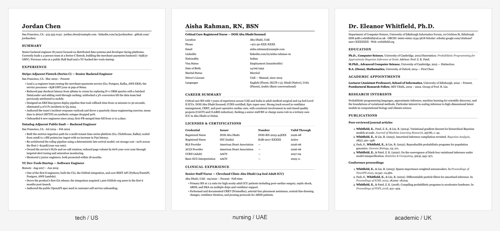

# cv-creator

A Claude Code skill that generates, reviews, and ATS-optimizes CVs/résumés across multiple regions and high-volume industries.



*Same skill, three regions × three industries. Markdown source → PDF + DOCX via pandoc. Examples in [`skills/cv-creator/examples/`](skills/cv-creator/examples/).*

## What it does

Four modes, one entry point:

| Mode | Trigger phrases | What happens |
|---|---|---|
| **Create** | "create a CV", "make a résumé", "draft a Lebenslauf" | Asks region / industry / seniority, fills the right template from your notes, writes Markdown + builds PDF + DOCX |
| **Improve bullets** | "improve these bullets", "rewrite this experience" | Applies an action-verb + quantified-result + impact rubric |
| **Review** | "review my CV", "critique this résumé" | Scores an existing CV against region norms (length, photo, structure, ATS hazards) |
| **ATS-optimize** | "tailor my CV to this job", "optimize for this JD" | Extracts JD keywords, suggests targeted edits |

## Coverage (v1)

**Regions** — US/Canada, UK/EU, Germany (Lebenslauf), Academic, UAE/GCC

**Industries** — Tech, Nursing, Finance, Sales, Trades, Creative, Executive

The design separates regional **archetypes** (skeleton: length, photo, sections, personal-detail rules) from industry **overlays** (section emphasis, must-have credentials, bullet patterns). Any region × any industry composes at fill time.

## Install

### Via custom marketplace (recommended while pre-official)

```
/plugin marketplace add farazfookeer/cv-creator
/plugin install cv-creator@cv-creator-marketplace
```

Claude reads `.claude-plugin/marketplace.json` from the repo root.

### Manual

Copy `skills/cv-creator/` into `~/.claude/skills/`:

```
git clone https://github.com/farazfookeer/cv-creator
cp -r cv-creator/skills/cv-creator ~/.claude/skills/
```

## Dependencies

PDF + DOCX output requires [pandoc](https://pandoc.org). For PDF specifically, also a TeX engine (xelatex, via TeX Live or MacTeX). The skill runs `scripts/check-deps.sh` first and prints platform install commands if anything is missing.

If you only need Markdown, no dependencies are required.

```bash
# macOS
brew install pandoc
brew install --cask mactex-no-gui   # ~1.5 GB; or basictex for less

# Debian/Ubuntu
sudo apt install pandoc texlive-xetex texlive-fonts-recommended

# Windows
choco install pandoc miktex
```

## Usage

```
/cv-creator
```

Then describe what you want. The skill will route you into the right mode and ask the minimum set of clarifying questions.

## Out of scope (v1)

- Japanese rirekisho, Chinese 简历, India-specific formats — open to PRs
- Cover letters — separate skill planned
- LinkedIn import — out of scope

## Contributing

PRs welcome. The most valuable contributions are:

1. New region archetype (`skills/cv-creator/templates/regions/<region>.md`) + entry in `reference/region-norms.md`
2. New industry overlay (`skills/cv-creator/templates/industries/<industry>.md`)
3. Real-world example CVs in `examples/`

See [CONTRIBUTING.md](CONTRIBUTING.md) for the full guide and [`skills/cv-creator/SKILL.md`](skills/cv-creator/SKILL.md) for the contracts each template must satisfy.

## Privacy

The skill runs entirely locally and transmits no data of its own. Claude's processing of your prompts is governed by [Anthropic's Privacy Policy](https://www.anthropic.com/privacy). See [PRIVACY.md](PRIVACY.md) for details.

## License

MIT — see [LICENSE](LICENSE).
